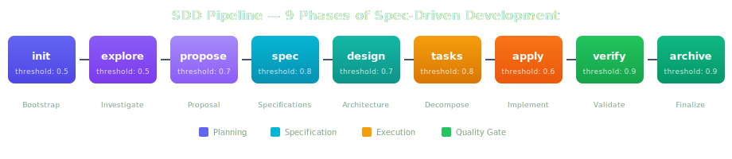
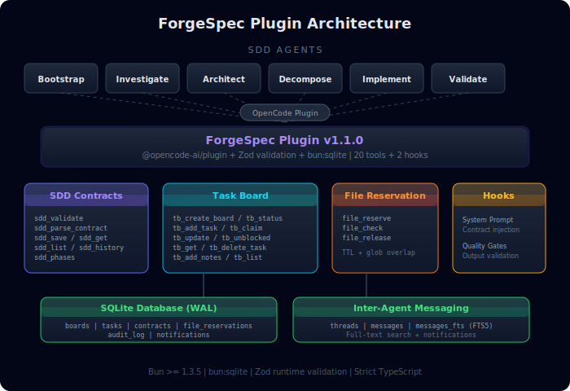
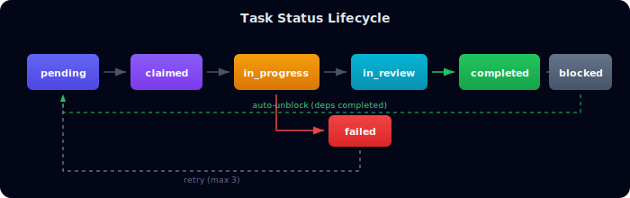

<p align="center">
  
</p>

<p align="center">
  <a href="https://github.com/lleontor705/forgespec/actions/workflows/ci.yml"></a>
  <a href="https://www.npmjs.com/package/forgespec"></a>
  <a href="https://github.com/lleontor705/forgespec/blob/master/LICENSE"></a>
</p>

---

Production-grade OpenCode plugin for **Spec-Driven Development** with multi-agent AI coordination. Provides Zod contract validation for 9 SDD phases, SQLite-backed task board with dependency auto-unblocking, advisory file locking for parallel agent coordination, and inter-agent messaging with full-text search.

Compatible with **OpenCode**, **Claude Code**, **Gemini**, and **Codex**.

## Install

Add to your `opencode.json`:

```json
{
  "plugin": ["forgespec@latest"]
}
```

Requires **Bun >= 1.3.5**. Zero external dependencies beyond `@opencode-ai/plugin`.

## SDD Pipeline

<p align="center">
  
</p>

Each phase produces a **typed JSON contract** validated against phase-specific Zod schemas with enforced confidence thresholds. Contracts auto-migrate between schema versions.

## Architecture

<p align="center">
  
</p>

## Tools

### SDD Contracts (7 tools)

| Tool | Description |
|------|-------------|
| `sdd_validate` | Validate a JSON contract against its phase-specific Zod schema |
| `sdd_parse_contract` | Extract and validate contract from agent output text |
| `sdd_save` | Validate and persist a contract to the database |
| `sdd_get` | Retrieve a single contract by ID |
| `sdd_list` | List contracts with optional project/phase filters |
| `sdd_history` | Get phase transition history for a project |
| `sdd_phases` | Get all phases with confidence thresholds and transition rules |

### Task Board (10 tools)

<p align="center">
  
</p>

| Tool | Description |
|------|-------------|
| `tb_create_board` | Create a task board from decomposed tasks |
| `tb_status` | Get current board state grouped by status |
| `tb_claim` | Claim a task (atomic lock with dependency check) |
| `tb_update` | Update task status with auto-notification and unblocking |
| `tb_unblocked` | List tasks ready to execute (all deps completed) |
| `tb_get` | Get full task details including notes |
| `tb_add_task` | Add a follow-up task to an existing board |
| `tb_delete_task` | Delete a task (only pending/completed) with dependency cleanup |
| `tb_add_notes` | Append timestamped notes without changing status |
| `tb_list` | List all boards, optionally filtered by project |

### File Reservation (3 tools)

| Tool | Description |
|------|-------------|
| `file_reserve` | Reserve files/globs with TTL (default 15min) |
| `file_check` | Check if files are reserved by another agent |
| `file_release` | Release file reservations |

## Hooks

ForgeSpec registers two hooks that enforce SDD practices automatically:

### System Prompt Injection

The `experimental.chat.system.transform` hook detects SDD agents and injects contract formatting guidelines into their system prompts. The orchestrator receives separate validation instructions.

### Quality Gates

The `tool.execute.after` hook intercepts `tb_update(status=completed)` and rejects:

- **Output too short** (< 20 characters)
- **Output too vague** ("done", "ok", "ready", etc.)
- **Missing SDD-CONTRACT block** (for SDD pipeline agents)

Rejected tasks revert to `in_progress` with a detailed failure message.

## Contract Structure

Every SDD contract follows this envelope:

```json
{
  "schema_version": "1.1",
  "phase": "propose",
  "change_name": "add-auth-service",
  "project": "my-app",
  "status": "success",
  "confidence": 0.85,
  "executive_summary": "Added JWT-based authentication with role-based access control",
  "artifacts_saved": [
    { "topic_key": "sdd/add-auth-service/proposal", "type": "cortex" }
  ],
  "next_recommended": ["spec", "design"],
  "risks": [
    { "description": "Token rotation not yet designed", "level": "medium" }
  ],
  "data": { }
}
```

Each phase defines its own `data` schema. See [`src/contracts.ts`](src/contracts.ts) for the full Zod definitions.

## Confidence Thresholds

| Phase | Threshold | Phase | Threshold |
|-------|-----------|-------|-----------|
| init | 0.5 | tasks | 0.8 |
| explore | 0.5 | apply | 0.6 |
| propose | 0.7 | verify | 0.9 |
| spec | 0.8 | archive | 0.9 |
| design | 0.7 | | |

## Database

ForgeSpec uses a shared SQLite database with WAL mode for concurrent access:

| Table | Purpose |
|-------|---------|
| `boards` | Task board definitions with project association |
| `tasks` | Individual tasks with dependencies, notes, and status tracking |
| `contracts` | Persisted SDD contracts for history and traceability |
| `file_reservations` | Advisory locks with TTL-based expiry |
| `audit_log` | Action audit trail for traceability |
| `threads` / `messages` | Inter-agent messaging with FTS5 search |
| `notifications` | Event sourcing for agent coordination |

## Exports

Other plugins can import shared utilities:

```typescript
import {
  getDatabase, logAudit, consumeNotifications,
  SDD_PHASES, CONFIDENCE_THRESHOLDS, VALID_TRANSITIONS,
  validateJson, extractContract, RiskSchema, ArtifactSchema,
  formatTaskStatus, formatBoardSummary, globOverlaps,
  TASK_STATUSES, generateId
} from "forgespec";
```

## Best Practices Skill

ForgeSpec includes a built-in best practices skill at [`skills/forgespec-best-practices/SKILL.md`](skills/forgespec-best-practices/SKILL.md). It covers:

- Contract validation patterns (validate-then-save)
- Task board lifecycle and status transition rules
- File reservation strategies for parallel execution
- Quality gate enforcement and how to write good task output
- Multi-agent coordination patterns with parallel groups
- Common pitfalls and their solutions

## Development

```bash
bun install            # Install dependencies
bun test               # Run all tests
bun run typecheck      # TypeScript strict checking
```

Run a single test file:

```bash
bun test test/contracts.test.ts
```

## Contributing

1. Fork the repo
2. Create a feature branch from `develop`: `git checkout -b feat/my-feature develop`
3. Make your changes and add tests
4. Run `bun test && bun run typecheck`
5. Open a PR to `develop`

## License

MIT
